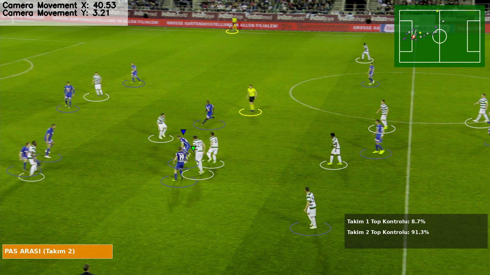

# ⚽ Futbol Video Analizi — Football Analysis with SoccerNet

> **Kırıkkale Üniversitesi — Bilgisayar Mühendisliği Bitirme Projesi**  
> Öğrenci: Abdüssamet Özden | Danışman: Dr. Öğr. Üyesi Enes Ayan

Yayın kalitesindeki futbol videolarından otomatik oyuncu tespiti, takibi, takım ataması ve aksiyon tespiti gerçekleştiren uçtan uca bir bilgisayarlı görü sistemi.

---

## 🎬 Demo


*Oyuncu takibi (takım renkli elipsler), top kontrolü (üçgen), 2D Minimap radar ve aksiyon banner'ı*

---

## 🔧 Özellikler

| Bileşen | Yöntem |
|---------|--------|
| Nesne Tespiti | YOLOv8m — 5 sınıf (oyuncu, top, kaleci, hakem, diğer) |
| Çok Nesne Takibi | BoTSORT (IoU + görünüm + kamera hareketi telafisi) |
| Takım Ataması | KMeans kümeleme (forma rengi analizi) |
| Saha Koordinatı | Dinamik Homografi — SoccerNet GSR-2025 JSON |
| Aksiyon Tespiti | State Transition: Pas / Şut / Dribbling / Pas Arası |
| 2D Minimap | Gerçek saha koordinatlarıyla canlı radar |
| Turnover Analizi | Top kaybı takibi ve görselleştirme |

---

## 📁 Proje Yapısı

```
football_analysis_withSoccerNet/
│
├── 6_video_inference.py          # ← Ana giriş noktası (13 adımlı pipeline)
├── action_detector.py            # State Transition aksiyon motoru
├── ball_loss_analyzer.py         # Top kaybı (turnover) analizi
│
├── trackers/
│   └── tracker.py                # BoTSORT entegrasyonu, track birleştirme
│
├── team_assigner/
│   └── team_assigner.py          # KMeans takım ataması
│
├── player_ball_assigner/
│   └── player_ball_assigner.py   # Oyuncu-top eşleştirme
│
├── view_transformer/
│   └── view_transformer.py       # Homografi (piksel → gerçek saha m)
│
├── camera_movement_estimator/
│   └── camera_movement_estimator.py  # Optik akış ile kamera hareketi
│
├── speed_and_distance_estimator/
│   └── speed_and_distance_estimator.py
│
└── utils/
    ├── minimap_utils.py           # 2D kuş bakışı minimap
    ├── text_utils.py              # PIL tabanlı Türkçe karakter desteği
    ├── bbox_utils.py
    └── video_utils.py
```

---

## 🚀 Kurulum ve Çalıştırma

```bash
# 1. Repo'yu klonla
git clone https://github.com/sametzden/Football-Analysis.git
cd Football-Analysis

# 2. Sanal ortam oluştur ve aktif et
python3 -m venv .venv
source .venv/bin/activate

# 3. Bağımlılıkları yükle
pip install ultralytics supervision opencv-python scikit-learn Pillow

# 4. Model ağırlığını (best(2).pt) proje kök dizinine koy

# 5. Analiz et
python 6_video_inference.py
```

`6_video_inference.py` içindeki `MODEL_PATH`, `VIDEO_PATH`, `GAMESTATE_JSON` değişkenlerini kendi dosya yollarınıza göre düzenleyin.

---

## 🏗️ Pipeline (13 Adım)

```
Video Okuma → YOLOv8m Tespiti → BoTSORT Takibi → Kamera Hareketi Tahmini
     → Homografi Dönüşümü → Top İnterpolasyonu → KMeans Takım Ataması
          → Top Kontrolü → State Transition Aksiyon Tespiti
               → Turnover Analizi → Track Birleştirme
                    → 2D Minimap → Görselleştirme & Video Çıktısı
```

### Aksiyon Tespiti Mantığı

| Aksiyon | Kural |
|---------|-------|
| **PAS** | Top A takımından yine A takımına geçer |
| **PAS ARASI** | Top A takımından B takımına geçer |
| **ŞUT** | Top rakip kaleciye / ceza sahasına gider |
| **DRİBBLING** | Aynı oyuncu 1s+ top kontrolünde + ≥3m hareket |

---

## 📊 Model Performansı

Model Google Colab A100 GPU üzerinde SoccerNet GSR-2025 veri setiyle eğitilmiştir  
(50 epoch, 1280×1280 giriş, ~20 saat).

| Sınıf | mAP@50 |
|-------|--------|
| Oyuncu | >0.90 ✅ |
| Kaleci | >0.90 ✅ |
| Hakem | >0.90 ✅ |
| Top | <0.90 ⚠️ |

> **Not:** Model ağırlık dosyası boyutu nedeniyle repoya eklenmemiştir.

---

## 📚 Veri Seti

[SoccerNet GSR-2025](https://www.soccer-net.org/) — Her sahne için:
- 750 kare (~30 saniye, 25 FPS)
- Piksel ve gerçek saha koordinatları (metre)
- Kamera kalibrasyon verileri (homografi hesabı için)

---

## 📖 Referanslar

- Somers et al., *"SoccerNet Game State Reconstruction"*, CVPR Workshop, 2024. [arXiv:2404.11335](https://arxiv.org/abs/2404.11335)
- Jocher G. et al., *Ultralytics YOLOv8*, 2023.

---

## 📝 Lisans

Bu proje akademik amaçlı geliştirilmiştir.
